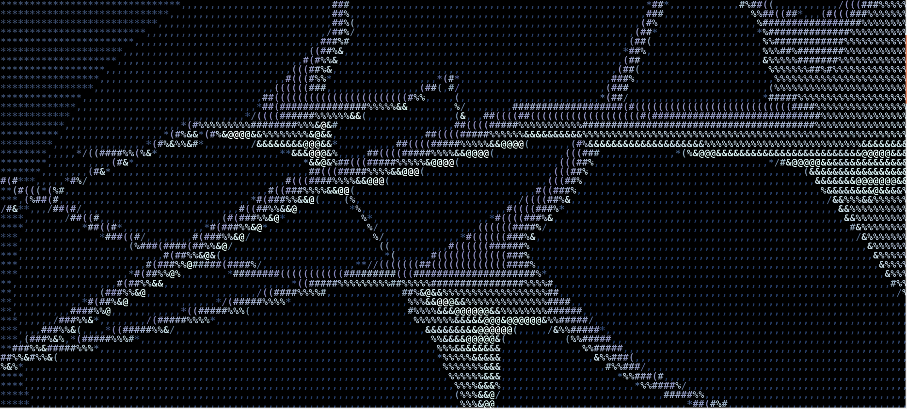

<p align="center">
  
</p>

# geist 👻

[](https://github.com/geisten/geist/actions/workflows/ci.yml)
[](LICENSE)
[](https://en.wikipedia.org/wiki/C23_(C_standard_revision))
[-lightgrey.svg)](#-build--usage)
[-yellow.svg)](#-status)

**geist** is a high-performance inference engine that runs LLMs **on the CPU
with zero dependencies** — one small static binary, no BLAS, no Python, no CUDA,
no runtime to install. Copy it to the machine and it runs.

That is the bet, and it is a different one from the universal engines:

- **Dependency-free, CPU-only.** Nothing to install — deploy by copying one file,
  embed it through the C ABI. The Linux ARM build is a single **fully static musl**
  binary (<1 MB, `ldd` → *not a dynamic executable*) that runs on any aarch64 Linux
  with no libc at all; the macOS build links **only the OS's own frameworks**
  (Accelerate + libSystem — Apple ships no static libc), so there's nothing to
  install there either.
- **Focused, not universal.** Where llama.cpp runs *every* model on *every*
  backend, geist does **a few models excellently** (Gemma 4 E2B-it today, ternary
  1.58-bit BitNet next) — every tensor bound to a hand-picked kernel at load time,
  not a generic dispatch loop.
- **Edge-first (Raspberry Pi 5).** Tuned for $50–$100 CPUs: a 4.6 B model fits in
  4 GB of RAM, no GPU or driver stack, decode at parity, on-device audio built in.
  The win is deploying and running *simply* on cheap hardware — not topping the
  prefill chart.

> **Status: experimental (v0.1.3).** The public API in [`include/geist.h`](include/geist.h)
> carries per-symbol stability tags (`STABLE` / `EXPERIMENTAL`). Expect churn in
> `EXPERIMENTAL` surfaces until 1.0. Issues and PRs welcome — see
> [CONTRIBUTING.md](CONTRIBUTING.md).

---

## ✨ Demo

Build, then point the `geist` CLI at a GGUF:

`make` builds the engine and drops a `./geist` symlink in the repo root:

```console
$ make
$ OMP_WAIT_POLICY=active ./geist gemma4-e2b-Q4_K_M.gguf "The capital of France is"
loaded gemma4-e2b-Q4_K_M.gguf (arch: transformer)
The capital of France is Paris.

$ OMP_WAIT_POLICY=active ./geist gemma4-e2b-Q4_K_M.gguf "Write a haiku about the ocean:" -n 40
Write a haiku about the ocean:

Blue waves crash on sand,
Salt spray kisses the warm air,
Ocean's deep secrets.
```

(`OMP_WAIT_POLICY=active` matters for multi-thread perf; `make run ARGS='…'` sets
it for you.)

*Real output from the `geist` CLI on Gemma 4 E2B-it (Q4_K_M), greedy decode.
Reproduce with `make fetch-model` then the commands above. The whole stable
text-generation core is ~70 lines of C — see
[`examples/simple_generate.c`](examples/simple_generate.c) to embed it.*

---

## 🚀 Performance — geist vs llama.cpp (Gemma 4 E2B-it, Q4_K_M, CPU-only)

The **identical** GGUF on both engines, full prefill sweep 128 → 1024 tokens.
Both engines' prefill is **flat with context**; geist wins outright on Apple
(AMX), while on the Pi llama.cpp's OpenBLAS path sits ~10–15 % higher.

**Apple M1 Max** — prefill t/s (best-of-10, both engines):

| seq_len | 128 | 256 | 512 | 1024 |
| :-- | :---: | :---: | :---: | :---: |
| llama.cpp `-ngl 0` | 141 | 147 | 128 | 97 |
| **geist** | **164** | **161** | **150** | **144** |
| | geist 1.16× | geist 1.10× | geist 1.17× | **geist 1.48×** |

**Raspberry Pi 5** — prefill t/s (both engines: prefill-only, 8 reps, cool start):

| seq_len | 128 | 256 | 512 | 1024 |
| :-- | :---: | :---: | :---: | :---: |
| **llama.cpp** (OpenBLAS) | **37.4** | **39.4** | **37.6** | **35.9** |
| geist | 34.8 | 34.2 | 32.9 | 31.5 |
| | llama 1.07× | llama 1.15× | llama 1.14× | llama 1.14× |

On **Apple Silicon** geist wins prefill at *every* length and the lead **widens**
with context (1.48× at 1024) — geist's dense path uses **Accelerate/AMX**, which
stays flat, while llama.cpp's CPU path drops off. On the **Pi 5** both curves are
flat but **llama.cpp's decades-tuned OpenBLAS sgemm leads geist by ~10–15 %** on
the A76 (no `i8mm`) — the hard case geist is built around; geist ties on **decode**
(~6.8 t/s) and wins on dependency-free distribution. *(Earlier Pi tables here
showed geist ahead — a thermal-throttling artifact in the llama measurement, now
corrected; see [`benchmark/`](benchmark/README.md).)*

📊 **Full sweep, ASCII charts, the per-phase analysis, and the methodology (cool
starts, best-of vs mean-of-10) live in [`benchmark/`](benchmark/README.md).**

---

## 🛠 Under the hood

The pitch above (dependency-free, focused, edge-first) is delivered by a few
deliberate engineering choices — the *how* behind the *why*:

### Zero-Dispatch Architecture
Unlike generic engines that use complex layer-dispatch loops, `geist` uses **Kernel Binding**. At load time, every tensor is bound directly to a specialized kernel pointer. This eliminates vtable overhead and management logic during the hot path—critical for single-core-heavy edge CPUs, and it is only practical because geist targets a *focused* set of models rather than every architecture.

### BLAS/FFT optional per platform
The `geist_gemm` abstraction (and the same per-platform pattern for the audio FFT) lets each platform pick the fastest path *and* the leanest dependency set: ARM ships fully self-contained (native NEON fp32 + a vendored radix-2 FFT, no OpenBLAS/FFTW), while macOS keeps Accelerate/AMX and vDSP because the framework is always present. This is what makes the "copy one file" deployment above possible without giving up the platform's matrix accelerator.

### Ternary (1.58-bit) as a First-Class Citizen
We don't treat low-bit formats as an afterthought. Our backend is built for a **multiplication-free future**. `geist` includes native paths for BitNet b1.58, where the CPU only performs additions and subtractions, maximizing performance on hardware without powerful NPUs.

### Native Multimodal Audio
`geist` features a built-in Conformer-based audio tower. Instead of a slow "Whisper → Text → LLM" cascade, we support direct audio-embedding prefixes. The LLM "hears" the audio directly, reducing latency and preserving prosody.

### Why C?
Not because it is the fastest (a systems language like Rust ties on raw
performance) and certainly not because it is the safest (it is the opposite).
The core reason is **reach, not speed**:

> **C is the substrate with maximal reach and minimal assumptions — the universal
> ABI and the everywhere-available, transparent compiler that every platform and
> every embedding language already speaks. We knowingly pay for that reach with
> memory safety.**

This maps directly onto promise #1 — *one file, runs anywhere, embeds anywhere*:
the header **is** the ABI (any language FFIs in with no shim), every
architecture/OS/accelerator toolchain speaks C first, and the source maps almost
1:1 to the emitted instructions — which matters when you reason about NEON kernels
by the cycle. Performance is table-stakes here, shared with the alternatives; what
picks C is ubiquity + zero-ceremony interop + transparency.

The honest counter-position: **if memory safety outweighed ubiquity and
simplicity for you, Rust would be the better choice.** We deliberately weighed it
the other way, and offset the safety cost with strict warnings
(`-Werror -Wshadow -Wundef`), ASan/UBSan CI (`make MODE=asan`), bit-exact golden
tests, and a small auditable core (the stable text path is ~70 lines).

---

## 📦 Build & Usage

### Requirements
- C compiler with `-std=c23` support: gcc ≥ 14, or Apple-clang ≥ 16 (Xcode 16 / macOS 15).
- `make`.
- **Mac:** Homebrew `libomp` recommended for multi-threading.

### Quick Start
```bash
# Build (target auto-detected: mac-omp / mac / pi5 / linux). Drops a ./geist symlink.
make                       # or: make TARGET=mac-omp | pi5 | linux

# Grab a reference model (Gemma 4 E2B-it Q4_K_M, ~3.1 GB) — optional helper.
make fetch-model

# Generate (the symlink saves you the bin/<target>/<mode> path):
OMP_WAIT_POLICY=active ./geist gguf_artifacts/gemma4-e2b-Q4_K_M.gguf "The capital of France is"
make run ARGS='gguf_artifacts/gemma4-e2b-Q4_K_M.gguf "Write a haiku" -n 40'   # same, OMP set for you

# Or the interactive evaluation REPL (full build dir; eval_geist has no symlink):
OMP_WAIT_POLICY=active bin/`mk/detect-target.sh`/release/tools/eval_geist gguf_artifacts/gemma4-e2b-Q4_K_M.gguf
```

A minimal C program using the public API lives in
[`examples/`](examples/) — build it with `make -C examples`.

---

## 🗺 Roadmap

- [x] **Flatten Pi 5 prefill:** FFN-streaming, lm-head argmax, and a multi-threaded
  O(n²) attention core — the Pi prefill curve is now flat (pp1024 +35 %), though
  llama.cpp's OpenBLAS still edges raw prefill on the A76.
- [ ] **BitNet Optimization:** Reach 1.0x reference parity for 2B-4T ternary models on Pi 5.
- [ ] **Dynamic Quantization:** Release the first mixed-low-bit recipe for Gemma 4.
- [ ] **Dynamic runtime threading:** choose the thread count per phase, and back off
  under thermal/load pressure, at runtime — instead of the fixed prefill=4 / decode=3.
- [ ] **Single-file app + model:** fuse the weights into the executable so a
  deployment is literally *one* binary — engine and model, nothing else to ship.
- [ ] **Realtime Audio Demo:** A standalone VAD-to-Instruction voice assistant on Pi 5.

---

## 🧭 Status

`geist` is **v0.1.3 — experimental**. It runs Gemma 4 (text + vision + audio) end
to end on the CPU backends and has a broad C test suite (`make test`), but the
`EXPERIMENTAL`-tagged parts of the API (KV-cache modes, speculative decode, AWQ,
multimodal attach) may still change between minor versions. The `STABLE` core
(load → session → decode → tokenize) is the part to build on.

## 📜 License & Contribution

`geist` is licensed under the **Apache License 2.0** — permissive, with an
explicit patent grant. See [LICENSE](LICENSE) and [NOTICE](NOTICE) for details.

We welcome technical contributions, especially in the area of **NEON/AMX
microkernels** and **low-bit quantization research**. Start with
[CONTRIBUTING.md](CONTRIBUTING.md).

---

*“The future of AI is local, private, and embedded.”* 👻
