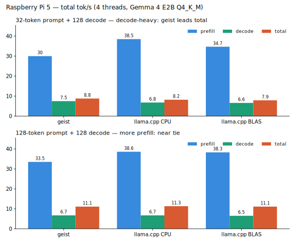

<p align="center">
  
</p>

# geist 👻

> Run a real LLM on a low-cost CPU box and get **close to big-model quality** —
> through aggressive, platform-specific optimization and an agent harness, not a
> bigger model. The smallest builds need no model file at all: **one binary is the
> whole thing** — no BLAS, no Python, no CUDA, nothing to install.

[](https://github.com/geisten/geistlib/actions/workflows/ci.yml)
[](LICENSE)
[](https://en.wikipedia.org/wiki/C23_(C_standard_revision))
[-lightgrey.svg)](#-getting-started)
[-yellow.svg)](#-status)

**geist** is a high-performance inference engine that runs small LLMs **on the CPU
with zero dependencies**. On the platforms it targets it is **already faster than
llama.cpp** end-to-end — and ~2× Microsoft's bitnet.cpp on ternary models (see the
[benchmarks](#-features)). One small static binary. Copy it to a machine and it
runs — it generates text, reads your local files, and searches the web, all
locally.

For now we focus on a **handful of models** — mostly quantized and tuned for
specific target platforms — rather than running everything everywhere. That is a
deliberate scope, not a ceiling: GPU support is on the roadmap too, where the aim
is highly-optimized, **near-real-time** inference.

## Run it now

One command — the installer picks your platform, downloads the single-file
**`geist-bitnet`** (BitNet 2B-4T baked in), and puts it on your PATH:

```bash
curl -fsSL https://raw.githubusercontent.com/geisten/geistlib/main/install.sh | sh
geist-bitnet "The capital of France is"
```

That binary *is* the whole app — no model file, no BLAS, no Python, no CUDA.
Prefer a manual download, or want vision + audio? Pick a path below.

### ① One file, nothing else — BitNet 2B-4T baked in

A small binary with the model **baked in** — download, run, no model argument:

| Platform | Single-file download (model included) |
| :-- | :-- |
| **Raspberry Pi / Linux** · ARM64 | [⬇ geist-bitnet-linux-arm64.tar.gz](https://github.com/geisten/geistlib/releases/latest/download/geist-bitnet-linux-arm64.tar.gz) |
| **macOS** · Apple Silicon | [⬇ geist-bitnet-macos-arm64.tar.gz](https://github.com/geisten/geistlib/releases/latest/download/geist-bitnet-macos-arm64.tar.gz) |

```bash
./geist-bitnet "The capital of France is"     # generate — no model argument
./geist-bitnet agent "Summarize report.md"    # one-shot tool-use agent
./geist-bitnet chat                           # multi-turn chat + memory
```

### ② The engine + your own model — text · vision · audio

The model-less binary is **< 1 MB**; pair it with a GGUF. A model file is **not
platform-specific** — one download runs on every platform.

| Platform | Engine (model-less) |
| :-- | :-- |
| **macOS** · Apple Silicon | [⬇ geist-macos-arm64.tar.gz](https://github.com/geisten/geistlib/releases/latest/download/geist-macos-arm64.tar.gz) |
| **Raspberry Pi / Linux** · ARM64 | [⬇ geist-linux-arm64.tar.gz](https://github.com/geisten/geistlib/releases/latest/download/geist-linux-arm64.tar.gz) |

| Model (one file, any platform) | Size | Direct download |
| :-- | --: | :-- |
| **Gemma 4 E2B-it** · `Q4_K_M` — text · vision · audio | 2.9 GB | [⬇ gguf](https://huggingface.co/unsloth/gemma-4-E2B-it-GGUF/resolve/main/gemma-4-E2B-it-Q4_K_M.gguf) |
| **Gemma 4 E4B-it** · `Q4_K_M` — bigger, text · vision · audio | 4.6 GB | [⬇ gguf](https://huggingface.co/unsloth/gemma-4-E4B-it-GGUF/resolve/main/gemma-4-E4B-it-Q4_K_M.gguf) |
| **BitNet b1.58 2B-4T** · `i2_s` — ternary, fast on edge | 1.1 GB | [⬇ gguf](https://huggingface.co/microsoft/bitnet-b1.58-2B-4T-gguf/resolve/main/ggml-model-i2_s.gguf) |

```bash
./geist       model.gguf "The capital of France is"   # generate text
./geist agent model.gguf "Summarize report.md"        # one-shot tool-use agent
./geist chat  model.gguf                               # multi-turn chat + memory
```

<sub>x86 / Windows wait on the AVX backend — [build from source](#-getting-started) meanwhile.</sub>

<p align="center">
  
</p>

*The single self-contained `geist-bitnet` — BitNet 2B-4T baked in, no model file,
no deps. The same binary runs real-time on a [Raspberry Pi 5](#faster-where-it-counts-on-the-edge).*

---

## ✨ Features

### One binary, zero dependencies
Static musl on Linux ARM (< 1 MB), Apple frameworks only on macOS. Fold the model
in too (`make EMBED_MODEL=…`) and deployment is *literally one file*.

### Faster where it counts on the edge
Same GGUF, greedy decode. geist leads **end-to-end throughput** on a Pi 5 and
**prefill** on Apple's matrix unit:

| model | platform | metric | **geist** | baseline |
| :-- | :-- | :-- | --: | --: |
| Gemma 4 E2B-it (Q4_K_M) | **Pi 5** | total t/s (32p+128d) | **8.8** | 8.2 *(llama.cpp)* |
| Gemma 4 E2B-it (Q4_K_M) | **Pi 5** | decode t/s | **7.5** | 6.8 *(llama.cpp)* |
| Gemma 4 E2B-it (Q4_K_M) | **M1 Max** | prefill t/s (pp1024) | **144** | 97 *(llama.cpp)* |
| BitNet b1.58 2B-4T (`i2_s`) | **Pi 5** | decode t/s | **17.4** | 8.2 *(bitnet.cpp)* |



What you *feel* when you run a model is end-to-end throughput, and that's
decode-dominated — which is exactly where geist wins. Full methodology and the
complete sweep: [`benchmark/`](benchmark/README.md).

<p align="center">
  
</p>

*Real-time on a **Raspberry Pi 5** — ternary BitNet b1.58 2B-4T (`i2_s`), no GPU,
no driver stack.*

**Honest take — when to pick which:**

| Pick **geist** when… | Pick **llama.cpp** when… |
| :-- | :-- |
| You want the fastest end-to-end tokens on a Pi 5 / edge CPU | You need raw **prefill** on no-`i8mm` ARM (its OpenBLAS sgemm still edges geist ~10–15 %) |
| Deployment must be **one dependency-free binary** (no BLAS/Python) | You need a model or backend geist doesn't ship (GPU, x86, Llama/Qwen/Mistral, …) |
| You're embedding an engine through a plain **C ABI** | You want the broadest format & sampler coverage today |
| You run **ternary BitNet** (~2× bitnet.cpp) | — |

### Ternary (1.58-bit) as a first-class citizen
geist runs Microsoft's BitNet b1.58 (`TQ2_0` and canonical `I2_S`) with ARM
**SDOT** — integer add/subtract only, no multiplies. On a Pi 5 that's **~2×
Microsoft's own bitnet.cpp** (decode **17.4** vs 8.2 t/s).

### On-device agent for small models
A bounded, whitelist-gated tool loop lets a 2 B model *do* things — all in the same
process, nothing leaving the machine except an explicit web request:

| capability | tool | notes |
| :-- | :-- | :-- |
| List a directory | `list_dir` | `opendir`, no shell |
| Read & summarize a file | `summarize_file` | local — **no embeddings, no cloud** |
| Search local documents | `doc_search` | keyword scan (local RAG) |
| Search the web | `web_search` | DuckDuckGo or self-hosted **SearXNG** |
| Fetch & read a web page | `web_fetch` | `curl` → tag-stripped text |

*This toolset is expanding steadily.*

**Response time per task** — warm (model resident), greedy, via `geist agent`. A
light task's cost is the model **deciding + forming the call** (a few forward
passes); the tool's own I/O is milliseconds. **Summarize** runs the whole document
through the model, so it scales with length:

| task | Mac · Gemma 4 E2B | Pi 5 · BitNet 2B-4T |
| :-- | --: | --: |
| list a dir · fetch · search¹ | ~4–5 s | ~15–16 s |
| summarize a short note (~1 ¶) | ~5 s | ~18 s |
| summarize an 8 KB article (~4 chunks) | ~80 s | ~3.4 min |

<sub>¹ web tasks add the network round-trip. One-time model load is separate (~3 s
eager on macOS; the Pi `mmap`s). Single-run wall-clock on live machines — ballpark,
not a gate. The Pi figures include the cached router baseline ([#39](https://github.com/geisten/geisten/pull/39)).</sub>

### Native multimodal audio
A built-in Conformer audio tower — the LLM "hears" audio directly via embedding
prefixes, skipping the slow *Whisper → text → LLM* cascade. (Engine-level today;
agent tool wiring is next.)

<details>
<summary><strong>Why C?</strong> (the substrate choice, in full)</summary>

Not because it is the fastest (a systems language like Rust ties on raw
performance) and certainly not because it is the safest (it is the opposite).
The core reason is **reach, not speed**:

> **C is the substrate with maximal reach and minimal assumptions — the universal
> ABI and the everywhere-available, transparent compiler that every platform and
> every embedding language already speaks. We knowingly pay for that reach with
> memory safety.**

This maps directly onto promise #1 — *one file, runs anywhere, embeds anywhere*:
the header **is** the ABI (any language FFIs in with no shim), every
architecture/OS/accelerator toolchain speaks C first, and the source maps almost
1:1 to the emitted instructions — which matters when you reason about NEON kernels
by the cycle. Performance is table-stakes here, shared with the alternatives; what
picks C is ubiquity + zero-ceremony interop + transparency.

The honest counter-position: **if memory safety outweighed ubiquity and
simplicity for you, Rust would be the better choice.** We deliberately weighed it
the other way, and offset the safety cost with strict warnings
(`-Werror -Wshadow -Wundef`), ASan/UBSan CI (`make MODE=asan`), bit-exact golden
tests, and a small auditable core (the stable text path is ~70 lines).

</details>

---

## 📦 Models that run today

Two models are first-class and one-download-and-go. Everything below runs on the
same `./geist` binary — pick by your hardware and what you need.

| Model | Modality | Quant | ~Size | RAM | Best on | Get it |
| :-- | :-- | :-- | --: | --: | :-- | :-- |
| **Gemma 4 E2B-it** | text · vision · audio | `Q4_K_M` | 2.9 GB | ≥ 4 GB | Mac / Pi 5 | `make fetch-model` · [⬇ gguf](https://huggingface.co/unsloth/gemma-4-E2B-it-GGUF/resolve/main/gemma-4-E2B-it-Q4_K_M.gguf) |
| Gemma 4 E4B-it | text · vision · audio | `Q4_K_M` | 4.6 GB | ≥ 6 GB | Mac | [⬇ gguf](https://huggingface.co/unsloth/gemma-4-E4B-it-GGUF/resolve/main/gemma-4-E4B-it-Q4_K_M.gguf) |
| **BitNet b1.58 2B-4T** | text (ternary) | `i2_s` | 1.1 GB | ≥ 4 GB | **Pi 5 / edge** | [⬇ gguf](https://huggingface.co/microsoft/bitnet-b1.58-2B-4T-gguf/resolve/main/ggml-model-i2_s.gguf) |
| BitNet b1.58-large | text (ternary) | `TQ2_0` | 207 MB | ≥ 1 GB | smallest footprint | convert from [1bitLLM ↗](https://huggingface.co/1bitLLM/bitnet_b1_58-large) |

```bash
# Gemma 4 E2B-it (text + vision + audio towers, all on one binary)
make fetch-model

# BitNet b1.58 2B-4T — the ~2× decode win on a Pi 5
curl -L -o bitnet-2b4t.i2_s.gguf \
  https://huggingface.co/microsoft/bitnet-b1.58-2B-4T-gguf/resolve/main/ggml-model-i2_s.gguf
```

> **Vision & audio** ride on the Gemma 4 model — the engine has SigLIP (vision) and
> a Conformer (audio) tower built in; see [`docs/ARCHITECTURE.md`](docs/ARCHITECTURE.md)
> for attaching image/audio inputs. **TQ2_0** has no canonical GGUF yet — convert
> the 1bitLLM base (see [`benchmark/TERNARY_BITNET.md`](benchmark/TERNARY_BITNET.md)).

---

## 🚀 Getting Started

> **Just want to run it?** The prebuilt ARM64 one-liner is at the
> [top](#-run-it-now). This section builds from source — any platform with a C23
> compiler (and the only path for x86-64 until the AVX backend lands).

### Prerequisites
- A C23 compiler: **gcc ≥ 14**, or Apple-clang ≥ 16 (Xcode 16 / macOS 15).
- `make`.
- **macOS:** Homebrew `libomp` recommended for multi-threading.

### 1. Build
`make` auto-detects your target and drops a `./geist` symlink in the repo root:

```bash
git clone https://github.com/geisten/geistlib && cd geistlib
make                       # or: make TARGET=mac-omp | pi5 | linux
```

### 2. Get a model
```bash
make fetch-model           # Gemma 4 E2B-it Q4_K_M (~3.1 GB) — optional helper
```

### 3. Run

`make` drops a `./geist` symlink. It's one binary with three subcommands:

```bash
M=gguf_artifacts/gemma4-e2b-Q4_K_M.gguf
OMP_WAIT_POLICY=active ./geist       $M "The capital of France is"   # generate text
OMP_WAIT_POLICY=active ./geist agent $M "Summarize the file README.md"  # tool-use agent
OMP_WAIT_POLICY=active ./geist chat  $M                              # multi-turn chat + memory
```

```console
loaded gemma4-e2b-Q4_K_M.gguf (arch: transformer)
The capital of France is Paris.
```

> `make run ARGS='…'` sets `OMP_WAIT_POLICY=active` for you (it matters for
> multi-thread perf). Full agent + chat walk-throughs are under [Usage](#-usage).

---

## 💡 Usage

### Generate from the CLI

```console
$ OMP_WAIT_POLICY=active ./geist gemma4-e2b-Q4_K_M.gguf "Write a haiku about the ocean:" -n 40
Write a haiku about the ocean:

Blue waves crash on sand,
Salt spray kisses the warm air,
Ocean's deep secrets.
```

<p align="center">
  
</p>

### Drive the agent

The agent is a subcommand of the main CLI — **`geist agent`** — so the same binary
generates text *and* runs tools. It **forces the tool call by default**, so even
the bundled un-tool-trained models reliably drive the tools (set
`GEIST_FORCE_CALL=0` to let the model decide instead):

```console
$ ./geist agent model.gguf "Show me the contents of this folder"
notes.txt   report.md   config.toml   src

$ ./geist agent model.gguf "Summarize the file report.md"
The Q3 plan migrates the billing system to the new ledger service, aiming for 40%
lower reconciliation latency and a single source of truth for invoices …

$ ./geist agent model.gguf "Search the web for FIFA World Cup 2026"
1. 2026 FIFA World Cup - Wikipedia
   https://en.wikipedia.org/wiki/2026_FIFA_World_Cup
…
```

A per-step trace prints **by default** to **stderr** (so the answer on stdout
stays clean) — you can watch the agent route, call, and observe:

```console
$ ./geist agent model.gguf "Summarize the file report.md"
· routing summarize_file: selected
→ calling summarize_file: {"path":"report.md"}
⚙ running summarize_file
✓ observed summarize_file: The Q3 plan migrates the billing system …
● answering: The Q3 plan migrates the billing system …
```

Set `GEIST_AGENT_TRACE=0` to silence it (e.g. for scripting).

The same steps are a structured **output type** (`struct geist_agent_event`) your
own host can consume — render a spinner, log it, or stream it to a UI as JSON.
See [`docs/agent.md`](docs/agent.md#progress-events).

<p align="center">
  
  
</p>

*Real `geist-bitnet agent` runs (Mac, BitNet 2B-4T baked in, no model file). Left:
`list_dir`. Right: live `web_search`. The per-step trace prints by default.*

### Chat with memory

`geist chat` is a multi-turn conversation on the same engine, with the full
toolset plus a file-based **memory palace** (Markdown notes under `$GEIST_MIND_DIR`,
no DB, no embeddings):

```console
$ ./geist chat model.gguf
> /remember Fav color | My favorite color is teal.
remembered.
> My name is Germar.
 Hello Germar.
> What is my name?
 Your name is Germar.
```

Slash commands (`/remember`, `/recall`, `/notes`) are the reliable manual path; a
capable model can also call the `remember`/`recall` tools itself. Notes persist
across sessions.

### Embed the library (C)

The whole stable text path is this small:

```c
#include <geist.h>
#include <stdio.h>

int main(void) {
    struct geist_backend *be = nullptr;
    geist_backend_create("auto", nullptr, nullptr, &be);

    struct geist_model *model = nullptr;
    geist_model_load("gemma4.gguf", be, &model);

    struct geist_session *sess = nullptr;
    struct geist_session_opts opts = {0};
    geist_session_create(model, be, &opts, &sess);
    geist_session_set_prompt(sess, "The capital of France is");

    geist_token_t tok = 0;
    while (geist_session_decode_step(sess, &tok) == GEIST_OK) {
        const char *piece = geist_session_token_to_str(sess, tok);
        if (piece == nullptr) break;
        printf("%s", piece);
    }

    geist_session_destroy(sess);
    geist_model_destroy(model);
    geist_backend_destroy(be);
}
```

Build a runnable copy with `make -C examples` — full walkthrough in
[`docs/QUICKSTART.md`](docs/QUICKSTART.md).

### Ship one file (model baked in)

**Prebuilt:** every [release](https://github.com/geisten/geistlib/releases/latest)
ships a `geist-bitnet-<platform>.tar.gz` — BitNet 2B-4T already baked in, no model
file, no path argument. Download, extract, `./geist-bitnet "your prompt"` — or just
`curl … install.sh | sh` ([top](#run-it-now)). That's the whole app.

**Build your own** with any GGUF. The plain `make` build gives you a `geist` that
**takes a model path** (you bring the GGUF); a separate **`make EMBED_MODEL=…`** build
*bakes the model in*, so that binary needs **no model argument**.

Give it its own name with `EMBED_NAME` so it's never confused with the
model-needing `geist`:

```bash
make EMBED_MODEL=bitnet-2b4t.i2_s.gguf EMBED_NAME=geist-bitnet   # GGUF baked in (zero-copy)
./geist-bitnet "The capital of France is"            # generate — no model path
./geist-bitnet agent "Summarize the file report.md"  # tools too — no model path
```

(Agent + chat work on the baked-in model. To ship it, just copy the binary —
`bin/<target>/release/tools/geist` — under whatever name you like.)

Real-time on a **Raspberry Pi 5**, BitNet b1.58 2B-4T baked into the binary
(no model file, no deps):

<p align="center">
  
  
</p>

*Left: text generation. Right: `geist agent` routing to `summarize_file` and
summarizing a local file — the per-step trace prints by default — all from one
~1.2 GB binary with the weights aliased zero-copy from its read-only data.*

The weights are aliased from the binary's read-only data (no extra RAM), so this
suits **small** models — the binary grows by the model size, and >~1.5 GB exceeds
the 2 GB GitHub-release limit.

---

## 📚 Documentation

| Document | What it covers |
| :-- | :-- |
| [`docs/QUICKSTART.md`](docs/QUICKSTART.md) | Run the CLI and embed the library in two minutes. |
| [`docs/ARCHITECTURE.md`](docs/ARCHITECTURE.md) | The three layers, load-time kernel binding, the pipeline. |
| [`docs/agent.md`](docs/agent.md) | The tool-use agent, bundled tools, routing & forced calls, security model. |
| [`docs/DEPLOY.md`](docs/DEPLOY.md) | Single-binary builds, server/embedded deployment. |
| [`benchmark/`](benchmark/README.md) | Methodology & full results ([Apple/Pi 5](benchmark/BENCHMARK.md), [ternary BitNet](benchmark/TERNARY_BITNET.md)). |
| [`include/geist.h`](include/geist.h) | The public C API, with `STABLE` / `EXPERIMENTAL` stability tags. |

---

## 🧭 Status

`geist` is **v0.3.0 — experimental**. It runs Gemma 4 (text + vision + audio) end
to end on the CPU backends and has a broad C test suite (`make test`). The
`STABLE` core (load → session → decode → tokenize) is the part to build on;
`EXPERIMENTAL`-tagged surfaces (KV-cache modes, speculative decode, multimodal
attach) may still change between minor versions.

---

## 🤝 Contributing

Contributions are welcome — especially **NEON/AMX microkernels** and **low-bit
quantization research**, where most of the interesting work lives. Open an issue,
pick a [roadmap](ROADMAP.md) item, or send a PR. Start with
[CONTRIBUTING.md](CONTRIBUTING.md) and the [Code of Conduct](CODE_OF_CONDUCT.md).

---

## 🎓 Citation

Using geist in research? A "Cite this repository" button is on the repo sidebar
(from [`CITATION.cff`](CITATION.cff)), or use:

```bibtex
@software{schlegel_geist_2026,
  author  = {Schlegel, Germar},
  title   = {geist: a dependency-free CPU inference engine and on-device agent for small LLMs},
  year    = {2026},
  version = {0.3.0},
  url     = {https://github.com/geisten/geistlib}
}
```

---

## 📜 License

Licensed under the **Apache License 2.0** — permissive, with an explicit patent
grant. See [LICENSE](LICENSE) and [NOTICE](NOTICE).

---

📄 [Impressum](https://geisten.net/impressum.html) · © 2026 geisten Holding UG (haftungsbeschränkt)

*"The future of AI is local, private, and embedded."* 👻
