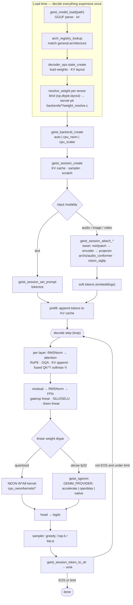

# geist Architecture

geist is a C23 inference runtime built around one idea: **decide everything
expensive at load time, so the hot path is branch-light.** This document maps
the codebase and the design rationale referenced from
[`include/geist.h`](../include/geist.h).

## Three layers

```
include/geist.h          public C ABI (the only supported surface)
  │
src/engine/              orchestration: model load, sessions, sampler,
  │                      tokenizers, allocators, backend/arch registries
src/archs/               architectures: how a model's forward pass is wired
  │   transformer/         Gemma 4 family (RoPE, GQA, KV cache, PLE, head)
  │   audio_conformer/     Conformer audio tower (mel → encoder → soft tokens)
  │   vision_siglip/       SigLIP vision tower (image/video → soft tokens)
src/backends/            compute: the kernels that actually run the ops
      cpu_neon/            Apple Silicon + ARM64, OpenMP-parallel
      cpu_scalar/          portable reference (correctness oracle)
      cpu_x86/             policy skeleton (no compute path yet)
src/formats/             GGUF + PTQTP quant (de)quantization
src/io/                  GGUF reader, safetensors reader
```

An **architecture** knows the shape of the computation (which ops, in which
order, with which tensors). A **backend** knows how to execute an op on a given
dtype/layout. The engine binds the two and drives sessions. Backends and archs
self-register into runtime registries (`src/engine/*_registry.c`), so the set
compiled in is a build-time choice (`make BACKENDS="..."`) and the one used is a
runtime choice (`geist_backend_create("auto" | "cpu_neon" | ...)`).

## Processing pipeline

End-to-end flow of a request, from loading a model to emitting tokens. Load-time
work (parse, kernel binding) happens once; the decode loop is the per-token hot
path. The dense-fp32 `geist_sgemm` node is where the build-time `GEMM_PROVIDER`
(accelerate / openblas / native) plugs in; quantized weights bypass it entirely
via the kernel bound at load time.



Speculative decode (`geist_session_decode_speculative`) replaces the single
`decode step` with an n-gram draft + one batched `verify_forward`; on a miss it
falls back to the sequential path shown above.

## Zero-dispatch kernel binding

Generic engines walk a layer-dispatch loop every token, switching on dtype and
op. geist instead resolves, **at model-load time**, a direct function pointer
for each tensor's `(op, dtype, layout)` combination
(`src/backends/*/weight_resolve.c`, `kernel_catalog.c`). The decode loop then
calls bound kernels with no vtable walk or format switch. This matters most on
single-core-heavy edge CPUs where dispatch overhead is a real fraction of the
per-token budget.

Capabilities are queryable up front via `geist_backend_supports_op` returning
`NONE` / `EMULATED` / `NATIVE`, so an arch can pick the best available path or
fail cleanly rather than discovering an unsupported combination mid-forward.

## Tensors: dtype vs layout

A `geist_tensor` separates the **logical** dtype (`F32`, `Q4_K`, `TQ2_0`, …)
from the **physical** layout (`DENSE`, `BLOCK_QUANTIZED`, `TERNARY_BITPLANE`,
…). Block-quantized formats carry a `geist_quant_desc` with bits-per-value as an
exact rational (`158/100` for 1.58-bit), block size, and scale/zero offsets.
This is what lets ternary BitNet be a first-class citizen rather than a bolt-on:
the kernel for a `TERNARY` weight does only adds/subtracts, no multiplies.

## Op vocabulary

The backend op set (`enum geist_op`) is deliberately small: `LINEAR`,
`RMSNORM`, `RESIDUAL_ADD`, `SILU_GATE`, `EMBEDDING_LOOKUP`, `ATTENTION`,
`ROPE`, plus reserved SSM ops (`SSM_STEP`/`SSM_SCAN`/`CONV1D`) for a future
Mamba arch. Fused attention (QKᵀ → softmax → V) is one op so the backend can
keep the score matrix in registers/L1.

## Sessions and the KV cache

A `geist_model` is immutable, shared, read-only weights. A `geist_session` owns
the mutable per-conversation state: KV cache, pending logits, sampler config,
stats. Multiple sessions can share one model. The KV cache supports quantized
modes (`INT8`, `KIVI`) and prefix pinning (`geist_session_pin_prefix`) to
amortize a constant system prompt across chat turns. Speculative decode drafts
via an n-gram lookup over history and verifies in one batched forward.

## Multimodal: soft-token prefixes

Instead of a "Whisper → text → LLM" cascade, the audio/vision towers produce
embedding **soft tokens** that are prefixed directly into the LM's KV cache
(`attach_audio` / `attach_image` / `attach_video`). The LM attends to the
modality embeddings directly, cutting latency and preserving information that a
text bottleneck would discard.

## Where to start reading

- The forward pass: `src/archs/transformer/forward/step.c`.
- Kernel binding: `src/backends/cpu_neon/weight_resolve.c`.
- A representative low-bit kernel: `src/backends/cpu_neon/kernels/q4_K.c`.
- The public contract: `include/geist.h` (stability tags per symbol).
